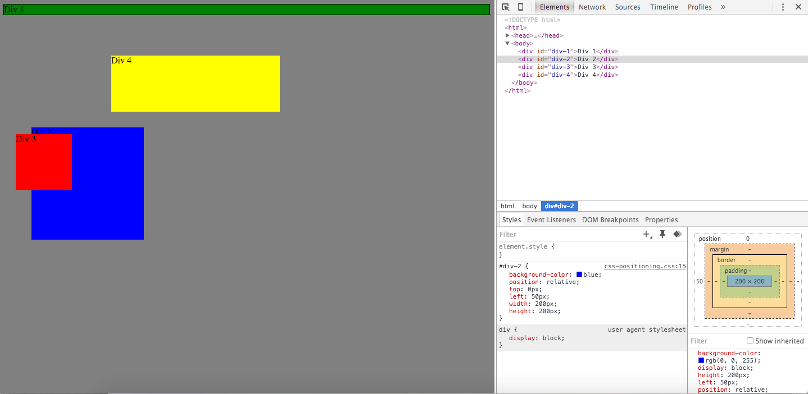
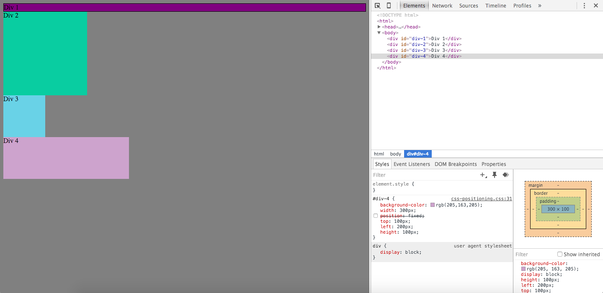
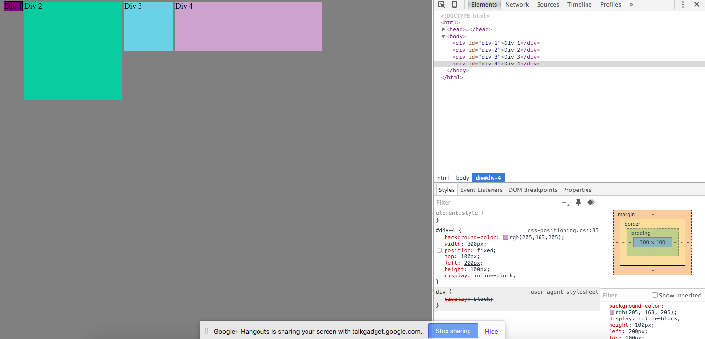
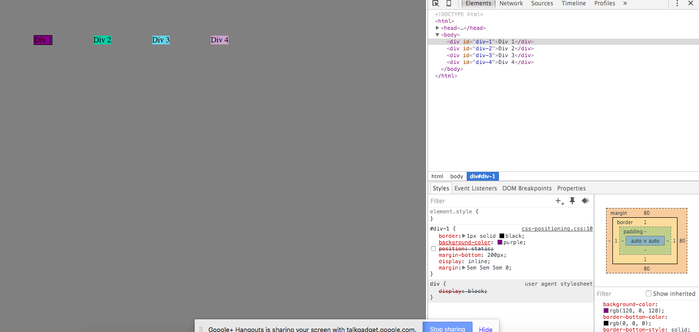
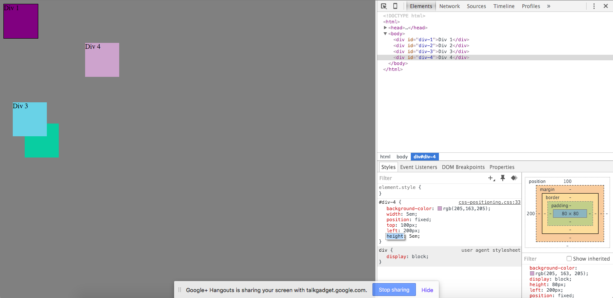
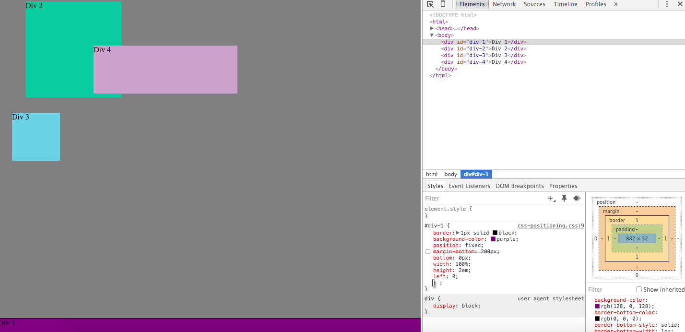
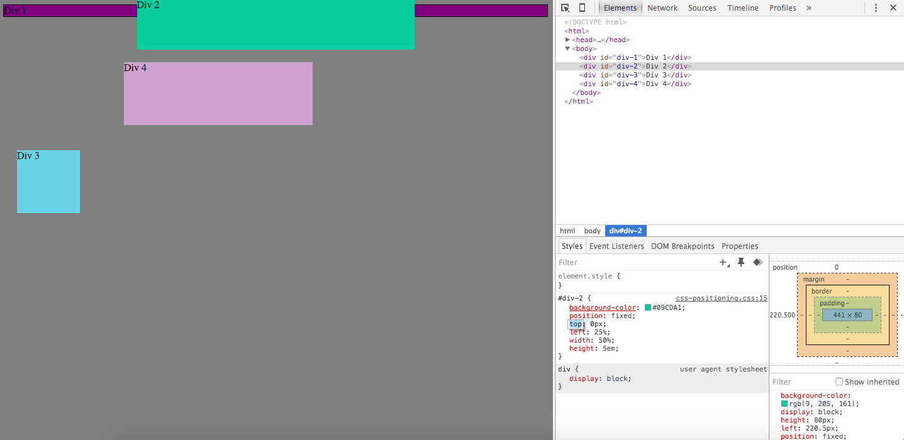
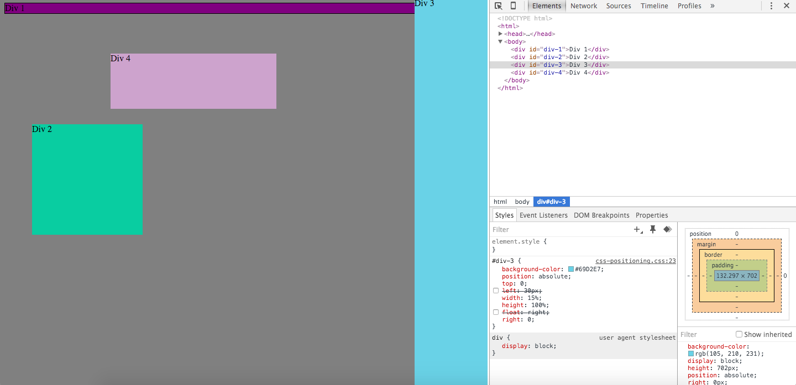
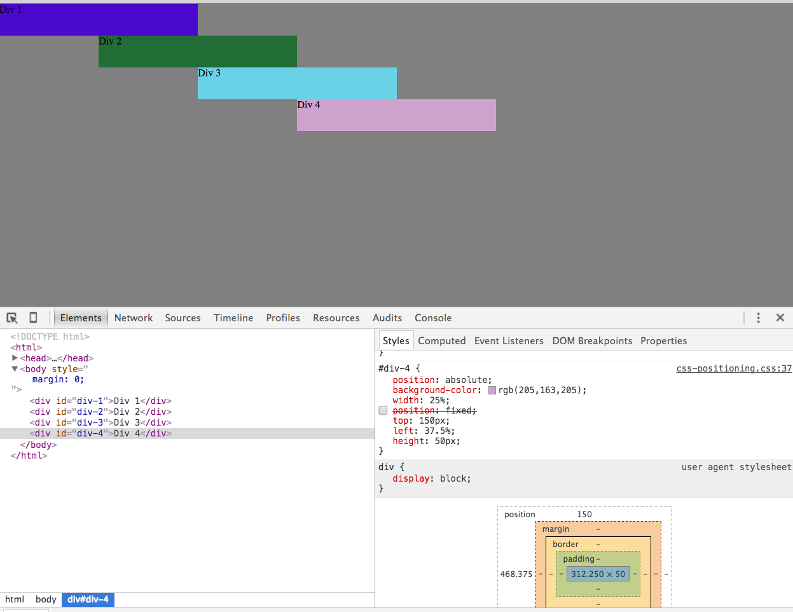

#How can you use Chrome's DevTools inspector to help you format or position elements?

You can use chrome's DevTools inspector to help format and position elements by altering the css on the web page to see how your elements look on the browser. It doesn’t alter your local files so there is no worry of messing up. It is very helpful.

#How can you resize elements on the DOM using CSS?

You can resize elements on the DOM using CSS by changing the height, width, border, padding, etc. 

#What are the differences between absolute, fixed, static, and relative positioning? Which did you find easiest to use? Which was most difficult?

Absolute positioning positions an element according to the element's properties in relation to its nearest positioned ancestor. Relative positioning positions elements away from their normal positioning. Fixed positioning positions elements according to the viewport, so basically it will stay in the same spot no matter what even if you scroll. Positioning static elements is basically just a way to make sure they are unaffected by top, right, bottom, and left properties. It is the default method for positioning elements. I found all of them difficult to understand and ended up using a variety of them to get the job done. I would say that fixed is the easiest to use though.

#What are the differences between margin, border, and padding?

Margin is the space around your object like the space between boxes in a room. Border is the edge of your object, like the box itself. Padding is space between your content and your border, sort of like bubble wrap protecting a vase in a box.

#What was your impression of this challenge overall? (love, hate, and why?)

I liked it I think it was very fun. Me and my pair got it done fast and then we experimented a bit. I thought it was easier than the other peer pairing challenge this week. Or that at least it was more fun.