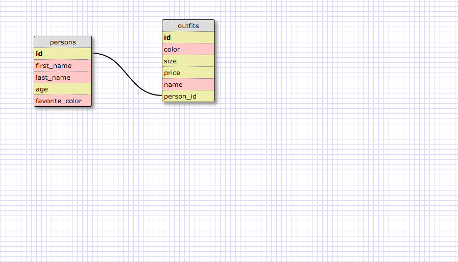

#What are databases for?

Databases are basically digital warehouses with an efficent system for storing and retrieving data. Databases are used to gather, store, and retrieve data for a peice of software. Most of the techniques we learned here will help us build databases for websites so that they can store data and then display that data when the user specifies what they need. The database system is much more effective then ruby hashes or javascript objects when it comes to storing large amounts of data.

#What is a one-to-many relationship?

A one to many relationship is where two or more items have a relationship where one is an aspect of a larger one and the larger one may have more than one aspect. For example a son will only have one biological mother whereas the biological mother may have more than one son. This is a one to many relationship. 

#What is a primary key? What is a foreign key? How can you determine which is which?

A primary key is basically the main form of identification for data in a table. Each instance of the primary key is unique and one of a kind. A foreign key is a key that links the foreign key of one database with the primary key of another. You can have more than one foreign key in a database, and foreign keys can accept null values. You can have multiple instances of a foreign key in a database this is not true of a primary key.

#How can you select information out of a SQL database? What are some general guidelines for that?

You can select information out of an sql database by using sql commands. Some guidelines for this ould be to always remember to use the SElECT an FROM commands. As well as pay attention to he order you are selecting things. Remember that ASC orders things in ascending order from top to bottom and DESC orders things in descending order from top to bottom. Lastly dont forget your semicolons.;
