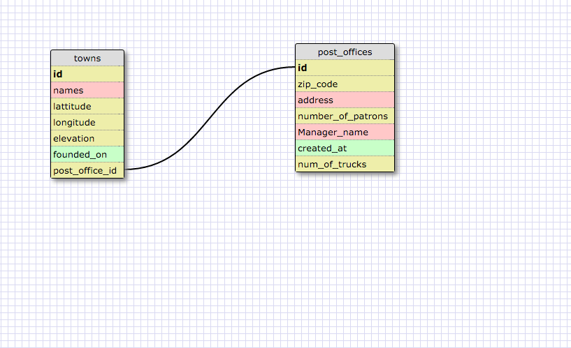
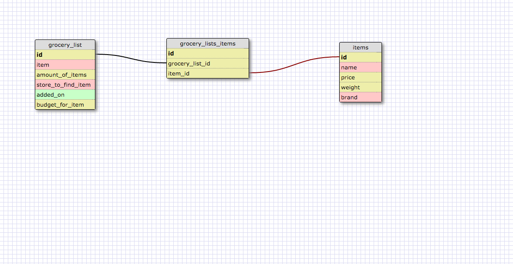

#What is a one-to-one database?

A one to one database is a database where the items stored have a one to one relationship with eachother. In the way that item one can only have one instance of item two, and item two can only have one instance of item one.

#An example of my one to one Database

#When would you use a one-to-one database? (Think generally, not in terms of the example you created).

You would use a one to one database when there is a unique one to one relationship between items. Where the items can only have one nstance of eachother. Just like how each person has only one heart and each hear belongs to only one person.

#What is a many-to-many database?

A many to many database is where there are multiple instances of each item in both item databases. There could be three instances of item one in item two and two instances of item two in item one. For example an animal can live in many habitats and a habitat can harbor many animals. This is an example of many to many relationship.

#An example of my many to many database

#When would you use a many-to-many database? (Think generally, not in terms of the example you created).

You would use a many to many database when you have multiple item to item relationships. Like with animals and habitats. You can use these many to many databases instead of repeating yourslef with repetitive rows and columns in one database. The main use of the many to many database is for when databases have a two way multiple instance relationship with themselves.

#What is confusing about database schemas? What makes sense?

The most confusing part about database schemas is figuring what to put in the schema and how to organize it. I often feel I am going about it in the totally wrong way. The easy part is organizing it and connecting foreign keys once you have figured out what to put in the database.
